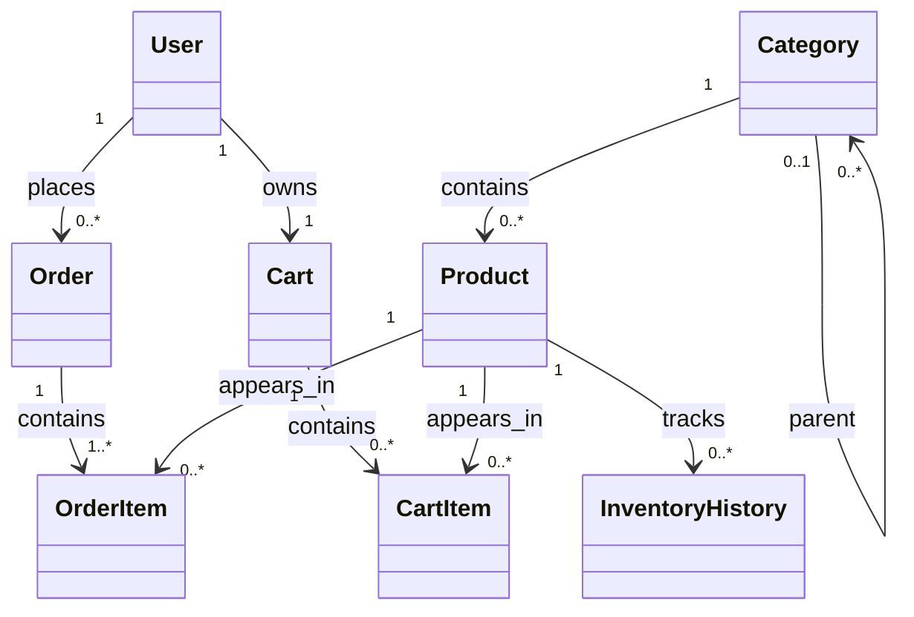

# Shop API

A comprehensive RESTful API for e-commerce built with Laravel 12, featuring advanced filtering, sorting, and pagination capabilities.

## 🚀 Quick Start

```bash
# Install dependencies
composer install

# Setup environment
cp .env.example .env
php artisan key:generate

# Setup database
touch database/database.sqlite
php artisan migrate
php artisan db:seed

# Start server
php artisan serve
```

The API will be available at `http://localhost:8000/api/v1/`

## 📚 Documentation

Complete documentation is available in the `docs/` directory:

- **[docs/README.md](./docs/README.md)** - Documentation navigation guide (START HERE)
- **[docs/PROJECT_OVERVIEW.md](./docs/PROJECT_OVERVIEW.md)** - Project description and goals
- **[docs/API_DOCUMENTATION.md](./docs/API_DOCUMENTATION.md)** - Complete API reference
- **[docs/ARCHITECTURE.md](./docs/ARCHITECTURE.md)** - Design patterns and architecture
- **[docs/SETUP_AND_DEVELOPMENT.md](./docs/SETUP_AND_DEVELOPMENT.md)** - Setup and development guide
- **[docs/DATABASE_SCHEMA.md](./docs/DATABASE_SCHEMA.md)** - Database schema documentation

## 🎯 Features

- ✅ RESTful API with 25+ endpoints
- ✅ Advanced filtering and sorting
- ✅ Pagination with metadata
- ✅ Request validation
- ✅ Standardized responses
- ✅ Comprehensive error handling
- ✅ Repository pattern
- ✅ Service layer architecture
- ✅ Full test coverage

## 📊 Entity Relationships



## 🔧 Technology Stack

- **Laravel 12** - PHP Framework
- **PHP 8.2+** - Programming Language
- **SQLite** - Database
- **PHPUnit** - Testing Framework
- **L5 Swagger** - API Documentation

## 📋 API Resources

### Products
- List products with filters (name, category, price, quantity)
- Sort by any field
- Include category relationships
- Pagination support

### Categories
- Hierarchical structure (parent-child)
- Filter by parent category
- List subcategories
- Full CRUD operations

### Orders
- Create and manage orders
- Filter by status or price range
- Track order items
- User-specific orders

### Carts
- Shopping cart management
- Add/remove items
- Quantity updates
- User-specific carts

### Inventory History
- Track stock changes
- Audit trail
- Product-specific history

## 🚀 Quick API Examples

```bash
# List all products
GET /api/v1/products

# Filter products by category and price
GET /api/v1/products?filter[category_id]=1&filter[min_price]=100&filter[max_price]=500

# Sort products by price
GET /api/v1/products?sort=price&order=asc

# Get product with category
GET /api/v1/products?include=category

# List root categories
GET /api/v1/categories?filter[parent_id]=null

# Get pending orders
GET /api/v1/orders?filter[status]=pending&sort=created_at&order=desc
```

## 🧪 Testing

```bash
# Run all tests
php artisan test

# Run specific test file
php artisan test tests/Feature/Controllers/Product/ListProductsControllerTest.php

# Run with coverage
php artisan test --coverage
```

## 📖 API Documentation

Access Swagger UI at: `http://localhost:8000/api/documentation`

Generate documentation:
```bash
php artisan l5-swagger:generate
```

## 🛠️ Development

```bash
# Run development server
php artisan serve

# Watch logs
php artisan pail

# Run migrations
php artisan migrate

# Run seeds
php artisan db:seed

# Clear cache
php artisan cache:clear
```

## 📦 Project Structure

```
app/
├── Dto/                    # Data Transfer Objects
├── Http/
│   ├── Controllers/        # API Controllers
│   ├── Requests/          # Request Validation
│   └── Responses/         # Response Objects
├── Models/                # Eloquent Models
├── Repositories/          # Data Access Layer
├── Services/              # Business Logic Layer
└── Transformers/          # Response Transformation

docs/                      # Complete Documentation
tests/                     # Feature & Unit Tests
routes/api.php            # API Routes
```

## 🤝 Contributing

1. Fork the repository
2. Create a feature branch
3. Make your changes
4. Write/update tests
5. Submit a pull request

## 📄 License

This project is open-sourced software licensed under the [MIT license](https://opensource.org/licenses/MIT).

## 📞 Support

For detailed documentation, see the `docs/` directory.
For API usage, see `docs/API_DOCUMENTATION.md`.
For development, see `docs/SETUP_AND_DEVELOPMENT.md`.
