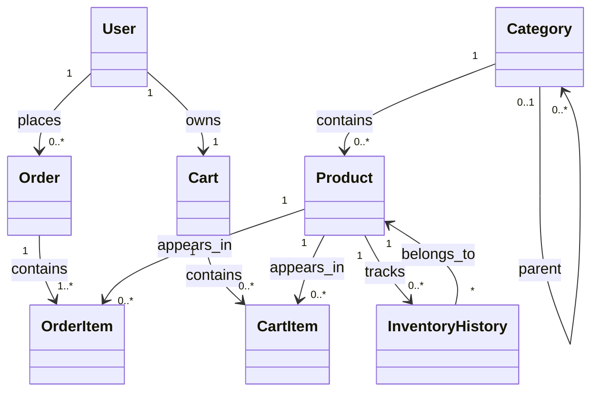

# shop-api

2. Categories
POST /categories → create a category
GET /categories → list all categories
GET /categories/:id → get category details
PUT /categories/:id → update category
DELETE /categories/:id → delete category

3. Products
POST /products → create a product
GET /products → list all products (with filters & pagination)
GET /products/:id → get product details
PUT /products/:id → update product
DELETE /products/:id → delete product
GET /products/search?q= → search products by name/description
GET /products/top-selling → list top-selling products
GET /products/category/:categoryId → products in a category

4. Orders
POST /orders → create an order
GET /orders → list all orders (admin)
GET /orders/:id → get order details (including items)
PUT /orders/:id → update order status
DELETE /orders/:id → cancel/delete order
GET /orders/user/:userId → list orders for a user

5. Order Items
POST /orders/:orderId/items → add product to order
PUT /orders/:orderId/items/:itemId → update quantity
DELETE /orders/:orderId/items/:itemId → remove item

7. Cart
POST /cart → create a cart (usually auto-created for user)
GET /cart/:userId → get user’s cart
POST /cart/:cartId/items → add item to cart
PUT /cart/:cartId/items/:itemId → update item quantity
DELETE /cart/:cartId/items/:itemId → remove item

10. Advanced / Optional
GET /inventory-history/:productId → see stock changes
GET /addresses/:userId → get user addresses
POST /addresses → add address
PUT /addresses/:id → update address
DELETE /addresses/:id → remove address
GET /audit-log → list all audit actions (admin only)

1. Basic Filters
GET /products?categoryId=1
GET /products?minPrice=10&maxPrice=100
GET /products?inStock=true
GET /products?minRating=4

2. Text Search
GET /products?search=phone

3. Sorting
GET /products?sort=price_asc or sort=price_desc
GET /products?sort=newest
GET /products?sort=top_selling
GET /products?sort=rating_desc

4. Advanced / Optional Filters
GET /products?categoryIds=1,2,5
GET /products?onSale=true
GET /products?categoryId=2&minPrice=20&maxPrice=200&inStock=true&sort=rating_desc

5. Pagination
GET /products?page=2&limit=20