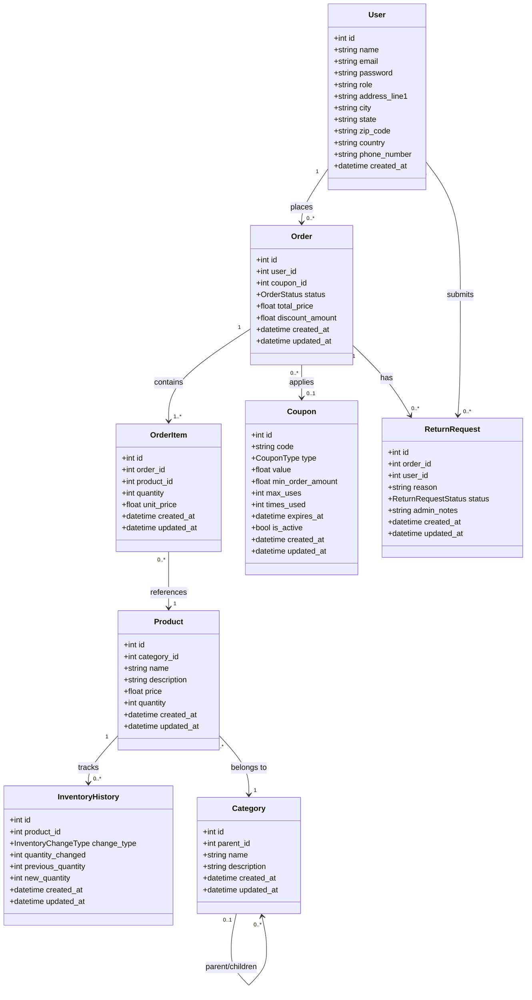
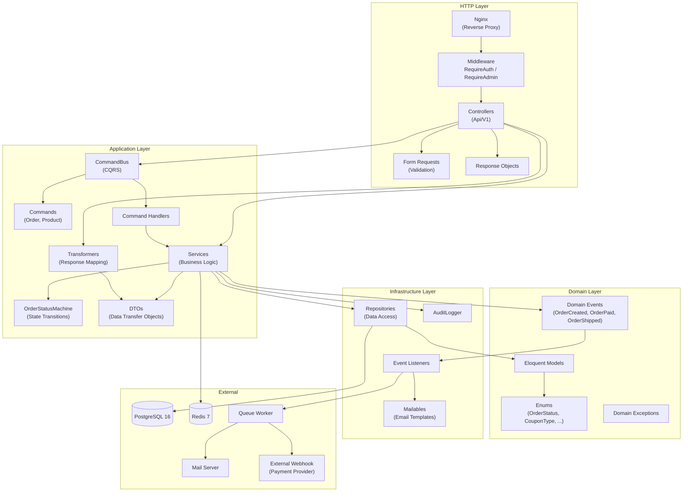
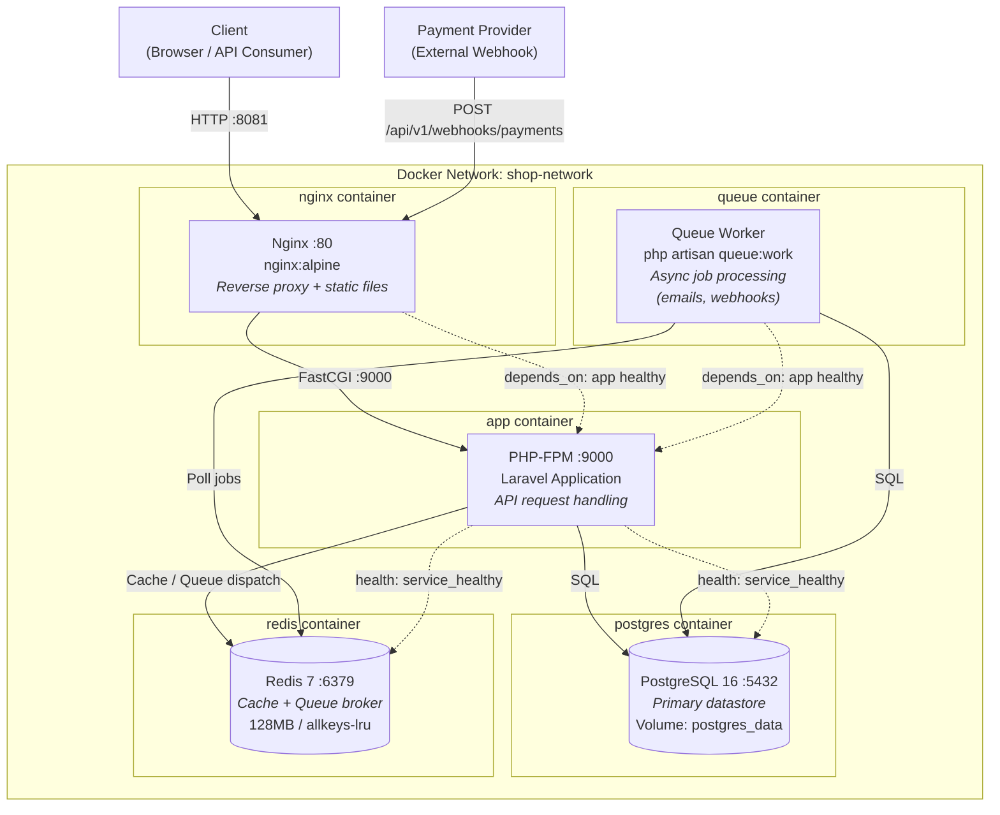
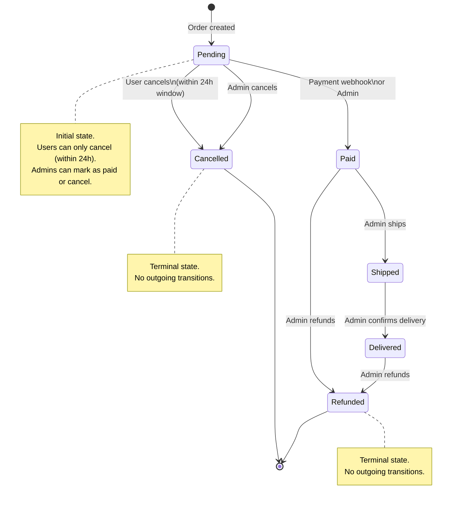
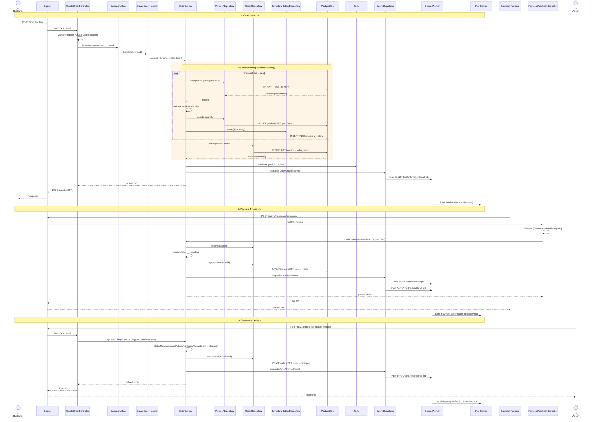

# Shop API - UML Diagrams

## Table of Contents
1. [Entity Relationship Diagram](#entity-relationship-diagram)
2. [Component Diagram](#component-diagram)
3. [Deployment Diagram](#deployment-diagram)
4. [Order State Diagram](#order-state-diagram)
5. [Order Lifecycle Sequence Diagram](#order-lifecycle-sequence-diagram)

---

## Entity Relationship Diagram

---

## Component Diagram

---

## Deployment Diagram

### Production Overrides (`docker-compose.prod.yml`)

| Service  | CPU Limit | Memory Limit | Security                                    |
|----------|-----------|--------------|---------------------------------------------|
| app      | 1.0       | 512 MB       | read-only, no-new-privileges, cap-drop: ALL |
| queue    | 0.5       | 256 MB       | read-only, no-new-privileges, cap-drop: ALL |
| nginx    | 0.5       | 128 MB       | read-only, cap-add: NET_BIND_SERVICE only   |
| postgres | 2.0       | 1 GB         | Internal port only (no host binding)        |
| redis    | 0.5       | 384 MB       | requirepass, internal port only              |

---

## Order State Diagram

### Transition Rules

| Actor | From | To | Condition |
|-------|------|----|-----------|
| User  | `pending` | `cancelled` | Within 24 hours of `created_at` |
| Admin | `pending` | `paid` | — |
| Admin | `pending` | `cancelled` | — |
| Webhook | `pending` | `paid` | Valid payment reference |
| Admin | `paid` | `shipped` | — |
| Admin | `paid` | `refunded` | — |
| Admin | `shipped` | `delivered` | — |
| Admin | `delivered` | `refunded` | — |

> `cancelled` and `refunded` are **terminal states** — no outgoing transitions are allowed.

---

## Order Lifecycle Sequence Diagram

